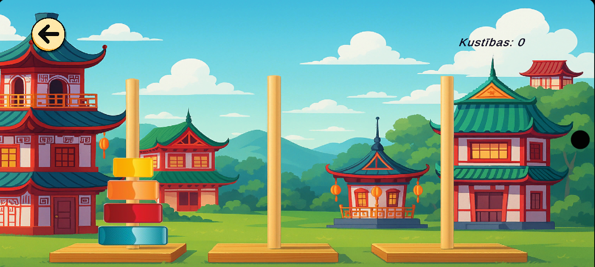
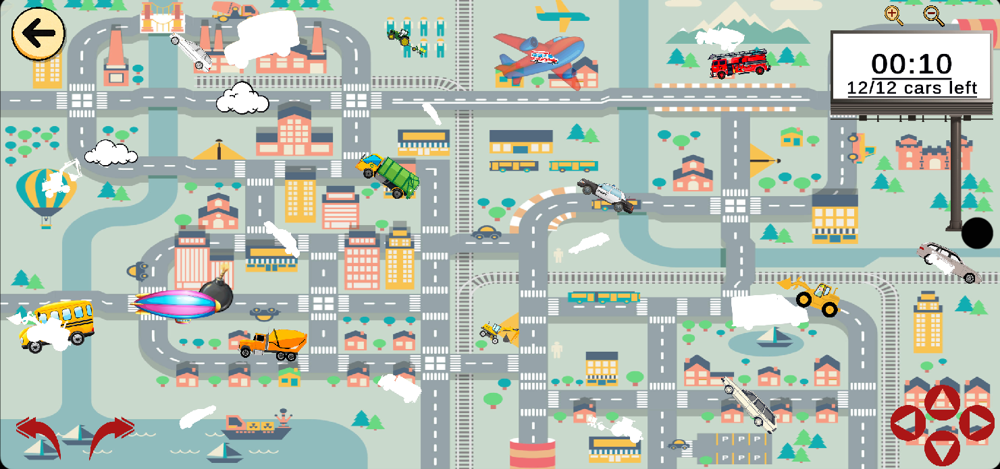
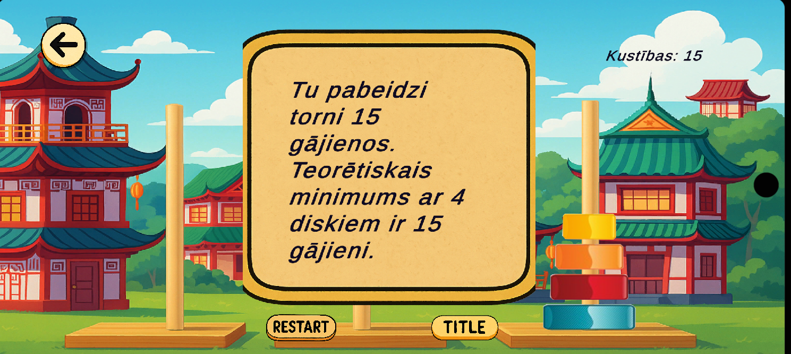

# 🎮 Unity 2D Games Collection

*2D Unity spēļu kolekcija bērniem (6+)*

---

## 📘 Project Overview

Šī kolekcija ietver divas izglītojošas un interaktīvas Unity spēles:  

1. **Drag & Drop Car Game** – bērni velk un novieto automašīnas pareizajās vietās kartē, izvairoties no šķēršļiem.  
2. **Hanoi Tower Game** – klasiskā Hanoja torņa spēle, kas palīdz attīstīt loģisko domāšanu, pārvietojot diskus starp stabiņiem, ievērojot noteikumus.

Šis projekts demonstrē Unity pamatus: **objektu manipulāciju, notikumu apstrādi, animācijas, scēnu pārvaldību un vienkāršu spēļu loģiku**.  

---
## 

Below are a few screens from the Hanoi Tower scene:

### Gameplay

### Win Screen

---

## 🚗 Drag & Drop Car Game

### 🧩 Features

- 🖱️ **Drag & Drop System** – Vilkšana un nomešana ar peli vai pieskārienu  
- 🔄 **Transformation Script** – Skalēšana, rotācija un pārvietošanas korekcija  
- 📌 **Object Fixation** – Automobiļi “pielīp” pareizajās vietās  
- 🎥 **Camera Controller** – Tuvināšana un pārvietošanas ierobežojumi  
- 🔊 **Sound System** – Fona mūzika un skaņas efekti  
- ☁️ **Animated Obstacles & Background** – Lidojoši šķēršļi, mākoņi, dzīvnieki un cilvēki  
- ⏱️ **Game Timer** – Laika skaitīšana HH:MM:SS formātā  

### 🕹️ How to Play

1. Sāc spēli no **Main Menu**  
2. Klikšķini un velc automašīnas pa karti  
3. Novieto katru automašīnu **pareizajā vietā**  
4. Izvairies vai iznīcini lidojošos šķēršļus  
5. Pabeidz izaicinājumu **ātrākajā iespējamajā laikā**  

### 🧾 To-Do List

- [x] Izveidot mapes un pievienot aktīvus  
- [x] Pievienot automašīnas  
- [x] Implementēt drag & drop sistēmu  
- [x] Pievienot transformation un fixation skriptus  
- [x] Pievienot kameru un ierobežojumus  
- [x] Pievienot lidojošus šķēršļus  
- [ ] Pievienot uzvaras loģiku  
- [x] Izveidot animētu galveno izvēlni  
- [x] Implementēt scēnu maiņu un iziešanu  
- [x] Pievienot spēles taimeri  
- [x] Pievienot animētus mākoņus, cilvēkus un transportu  

---

## 🏯 Hanoi Tower Game

### 🧩 Features

- 🖱️ **Drag & Drop Disks** – Pārvieto diskus ar peli vai pieskārienu  
- 🔄 **Disk Transformation Script** – Skalēšana, pozīcijas korekcija un animēta pārvietošana  
- 📌 **Move Validation** – Mazākos diskus var likt tikai uz lielākiem  
- 🎥 **Camera Controller** – Skata pielāgošana, lai redzami visi stabiņi  
- 🔊 **Sound System** – Fona mūzika un skaņas efekti  
- ⏱️ **Move Counter & Timer** – Skaita gājienus un kopējo spēles laiku  
- 🎬 **Animated Main Menu** – Animēta izvēlne ar skaņām  

### 🕹️ How to Play

1. Sāc spēli no **Main Menu**  
2. Klikšķini un velc diskus starp stabiņiem  
3. Atceries – **mazāks disks tikai uz lielāka diska**  
4. Pabeidz torni, pārvietojot visus diskus uz galveno stabiņu  
5. Mēģini to izdarīt **ar pēc iespējas mazāku gājienu skaitu**  

### 🧾 To-Do List

- [x] Izveidot mapes un pievienot aktīvus  
- [x] Pievienot diskus un stabiņus  
- [x] Implementēt drag & drop sistēmu  
- [x] Pievienot pārvietošanas validāciju  
- [x] Pievienot skaņas efektus un mūziku  
- [x] Izveidot animētu izvēlni  
- [ ] Pievienot uzvaras animāciju un punktu skaitīšanu  
- [ ] Dažādi grūtības līmeņi  
- [ ] Rekordu sistēma  

---

## 👨‍💻 Author

**Created by:** Estere Venena  
🎓 *School Project – Unity 2D Game Development*
